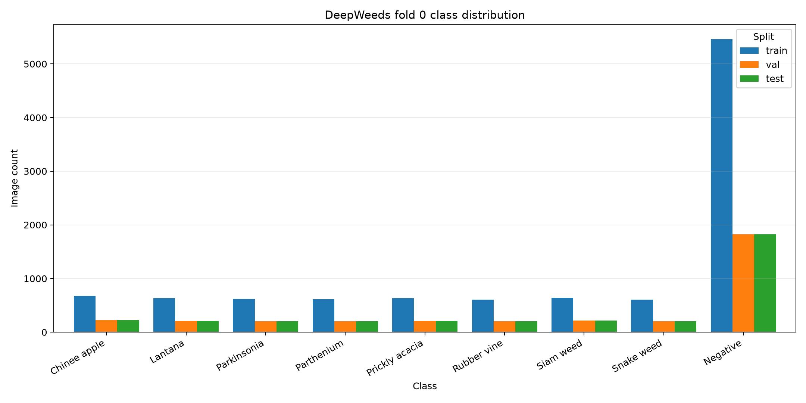

# DeepWeeds — báo cáo thí nghiệm

## 1. Tóm tắt

- Phân loại 9 lớp DeepWeeds, dùng fold 0 với 17.509 ảnh; các tập train/val/test lần lượt có 10.501/3.501/3.507 ảnh.
- Đã ghi nhận 5 backbone, 3 biến thể công thức ngoài baseline, 7 phương pháp suy luận và vòng chung kết 3 seed cho F01/T00.
- Kết quả `eval.py` trên dự đoán đã lưu: F01 đạt macro-F1 **0.9618 ± 0.0025**, top-1 **0.9694 ± 0.0014**; T00 cho kết quả giống hệt.
- Không có cải thiện đo được của F01 so với T00. Hai nhóm dự đoán trùng nhau theo seed; F01 đã chạy với cùng backbone, công thức T00 và suy luận I00.
- I01 có validation macro-F1 cao nhất (0.9638), nhưng phép suy luận đó **không được dùng ở vòng test cuối**; không suy rộng điểm validation sang test.
- Theo `eval.py grade` trên các dự đoán đã lưu: 14/19 điểm trong tiêu chí đã chấm; I4a chưa chấm do không có dự đoán test sau temperature scaling.

## 2. Dữ liệu và thiết lập

Nguồn là DeepWeeds, fold 0 nguyên bản. Audit ghi nhận 0 ảnh giao giữa các tập, hợp đủ 17.509 ảnh và không thiếu tệp. Negative chiếm 5.463/10.501 ảnh train (52,0%), vì vậy top-1 không đủ để đánh giá riêng chất lượng các lớp hiếm.

Các phép sàng lọc backbone dùng 2 epoch và một seed; ablation dùng 3 epoch và một seed; chung kết dùng 3 seed. Mọi chọn lựa backbone/công thức/phương pháp suy luận dựa trên validation. GPU ghi trong log là Tesla T4, PyTorch 2.11.0+cu130; tag trọng số từng backbone nằm trong workbook. Batch size 32, ảnh 224 px, AMP bật. Giới hạn thời gian khiến thí nghiệm ngắn hơn cấu hình khuyến nghị trong rubric.

## 3. So sánh backbone

| Backbone | Macro-F1 val | Top-1 val | Params (M) | GMAC |
|---|---:|---:|---:|---:|
| resnet50 | 0.5891 | 0.7258 | 23.53 | 4.09 |
| resnext50_32x4d | 0.6085 | 0.7366 | 23.00 | 4.23 |
| convnext_tiny | 0.9478 | 0.9592 | 27.83 | 4.45 |
| deit_small_patch16_224 | 0.9231 | 0.9429 | 21.67 | 4.24 |
| efficientnet_b0 | 0.6231 | 0.7098 | 4.02 | 0.38 |

`convnext_tiny` là kết quả validation tốt nhất trong nhóm sàng lọc ở 0.9478; được chọn làm backbone tiếp tục. Đây là sàng lọc ngắn, mỗi kiến trúc chỉ một seed và hai epoch, nên không đủ bằng chứng để kết luận ưu thế tổng quát giữa các kiến trúc.

## 4. Công thức huấn luyện

| ID | Thay đổi so với T00 | Macro-F1 val | Δ vs T00 | Giây/epoch |
|---|---|---:|---:|---:|
| T00 | basic / loss=ce / sampler=None | 0.9628 | +0.0000 | 80.1 |
| T01 | color / loss=ce / sampler=None | 0.9545 | -0.0083 | 133.3 |
| T02 | basic / loss=ls / sampler=None | 0.9625 | -0.0004 | 83.8 |
| T03 | basic / loss=ce / sampler=balanced | 0.9473 | -0.0155 | 81.5 |

 T01 (ColorJitter) giảm macro-F1 validation; T02 label smoothing gần baseline về macro-F1 nhưng ECE validation tăng mạnh; T03 balanced sampler không cho thấy mức tăng nhất quán trong một seed. Chênh lệch nhỏ không thể phân biệt với nhiễu do chỉ có một lần chạy ở mỗi ablation. Vì vậy công thức cuối không được chứng minh là tốt hơn T00.

## 5. Phương pháp suy luận

| ID | Phương pháp | Macro-F1 val | ECE val | p95 batch 1 (ms) | Chi phí tương đối |
|---|---|---:|---:|---:|---:|
| I00 | Standard 1-view FP32 | 0.9628 | 0.0088 | 7.10 | 1.00× |
| I01 | Horizontal flip TTA, K=2, mean probabilities | 0.9638 | 0.0053 | 33.25 | 3.31× |
| I02 | Multi-crop TTA, K=5, mean probabilities | 0.9637 | 0.0091 | 56.51 | 5.44× |
| I07 | Temperature scaling T=1.0867 | 0.9628 | 0.0068 | 7.10 | 1.00× |
| I04 | Test-time resolution / FixRes, 256 | 0.9619 | 0.0072 | 11.20 | 1.27× |

I01 (lật ngang, hai view) tăng macro-F1 validation từ 0.9628 lên 0.9638, còn p95 tăng từ 7.10 lên 33.25 ms. I02 dùng năm crop, tốn p95 56.51 ms mà không vượt I01. I07 khớp T=1.0867 chỉ bằng validation; ECE validation giảm từ 0.0088 xuống 0.0068, Top-1 không đổi.

**Giới hạn quan trọng:** test cuối là suy luận I00 (một view, không temperature scaling). Notebook đã chọn I01 trên validation nhưng không chuyển lựa chọn này vào F01 khi tạo dự đoán test. Vì quy tắc yêu cầu test một lần mỗi seed và dự đoán đã được tạo, báo cáo giữ số hiện có, không tạo lần đánh giá test mới. Do đó không có con số test cho I01 hoặc temperature scaling.

## 6. Chung kết và lỗi

| Cấu hình | Top-1 test (mean ± std) | Macro-F1 test (mean ± std) | ECE test (mean ± std) |
|---|---:|---:|---:|
| F01 | 0.9694 ± 0.0014 | 0.9618 ± 0.0025 | 0.0069 ± 0.0019 |
| T00 | 0.9694 ± 0.0014 | 0.9618 ± 0.0025 | 0.0069 ± 0.0019 |

Các số lấy từ `eval.py` chạy trên CSV dự đoán đã lưu, không lấy từ trường `test_metrics` trong log train vì các giá trị đó không khớp với bộ chấm chính thức. T00 và F01 có cùng dự đoán ở cả ba seed; chênh lệch macro-F1 là 0.0000, nhỏ hơn độ lệch chuẩn mẫu 0.0025.

### Precision / recall / F1 theo lớp (F01)

| Lớp | N test | Precision | Recall | F1 |
|---|---:|---:|---:|---:|
| Chinee apple | 226 | 0.963 | 0.922 | 0.942 |
| Lantana | 213 | 0.941 | 0.970 | 0.955 |
| Parkinsonia | 207 | 0.979 | 0.982 | 0.981 |
| Parthenium | 205 | 0.988 | 0.966 | 0.977 |
| Prickly acacia | 213 | 0.921 | 0.970 | 0.945 |
| Rubber vine | 202 | 0.978 | 0.950 | 0.964 |
| Siam weed | 215 | 0.977 | 0.980 | 0.978 |
| Snake weed | 204 | 0.961 | 0.912 | 0.935 |
| Negative | 1822 | 0.975 | 0.981 | 0.978 |

Recall thấp nhất là Snake weed (0.912), kế đến Chinee apple (0.922). Các nhầm lẫn thường gặp nhất trong ma trận cộng gộp ba seed:

- Negative → Prickly acacia: 41 occurrences across the three F01 test seeds.
- Chinee apple → Negative: 32 occurrences across the three F01 test seeds.
- Snake weed → Negative: 29 occurrences across the three F01 test seeds.
- Rubber vine → Negative: 28 occurrences across the three F01 test seeds.
- Negative → Lantana: 23 occurrences across the three F01 test seeds.
- Lantana → Negative: 14 occurrences across the three F01 test seeds.

Ma trận dưới đây là số lượng đúng / sai cộng qua 3 seed (hàng là nhãn thật, cột là nhãn dự đoán; tổng N=10.521):

| Thật \ Dự đoán | Chinee apple | Lantana | Parkinsonia | Parthenium | Prickly acacia | Rubber vine | Siam weed | Snake weed | Negative |
|---|---:|---:|---:|---:|---:|---:|---:|---:|---:|
| Chinee apple | 625 | 4 | 0 | 1 | 2 | 2 | 0 | 12 | 32 |
| Lantana | 0 | 620 | 0 | 0 | 0 | 0 | 0 | 5 | 14 |
| Parkinsonia | 2 | 0 | 610 | 0 | 4 | 0 | 0 | 0 | 5 |
| Parthenium | 3 | 1 | 4 | 594 | 6 | 0 | 0 | 1 | 6 |
| Prickly acacia | 0 | 0 | 6 | 2 | 620 | 0 | 0 | 0 | 11 |
| Rubber vine | 0 | 0 | 0 | 0 | 0 | 576 | 0 | 2 | 28 |
| Siam weed | 0 | 3 | 0 | 0 | 0 | 0 | 632 | 0 | 10 |
| Snake weed | 13 | 8 | 0 | 1 | 0 | 0 | 3 | 558 | 29 |
| Negative | 6 | 23 | 3 | 3 | 41 | 11 | 12 | 3 | 5364 |

Negative là lớp lớn và nhiều loài cỏ bị đoán thành Negative; ma trận cũng ghi nhận nhầm lẫn hai chiều Chinee apple ↔ Snake weed. Ảnh ví dụ trong `report_assets/error_examples.png` được lấy từ các lỗi seed 0 để xem thủ công. Đây là gợi ý trực quan, không thay thế đánh giá định lượng.

## 7. Khuyến nghị và hạn chế

- Với kết quả test đã có, dùng T00 + ConvNeXt-Tiny + I00 làm cấu hình chuẩn: macro-F1 0.9618 ± 0.0025, p95 batch-1 7.10 ms trên Tesla T4. Số latency là trên T4, không đại diện cho phần cứng robot.
- I01 là ứng viên nếu cần tối đa hóa điểm validation và ngân sách cho phép p95 khoảng 33 ms; chưa có điểm test cho phương pháp này.
- Bằng chứng hiện tại không cho thấy F01 cải thiện chất lượng so với baseline. Không kết luận các biến thể nhỏ hơn nhiễu là tốt hơn.
- Hạn chế: một fold, screening/ablation một seed, chỉ 2–3 epoch; một GPU; dự đoán F01/T00 trùng nhau; F01 chưa dùng I01; chưa có hiệu chuẩn test sau temperature scaling. Cần ghi nhận đây là giới hạn run đã hoàn tất, không tự điền kết quả còn thiếu.

## 8. Tái lập và tệp đính kèm

Workbook `results.xlsx` chứa Summary, Backbones, Training, Inference, Final, EvalPerSeed, PerClass và Latency. Code tái lập nằm trong `code/`, đồ thị trong `curves/`, CSV dự đoán chung kết/validation trong `predictions/`, còn log JSON/CSV gốc đã dùng để tạo bảng nằm trong `raw_results/`. Checkpoint không được đóng gói vì mỗi checkpoint vượt 16 MB; các đường dẫn và file `best.pth` gốc nằm dưới thư mục ignored `checkpoints/runs/` của workspace.
